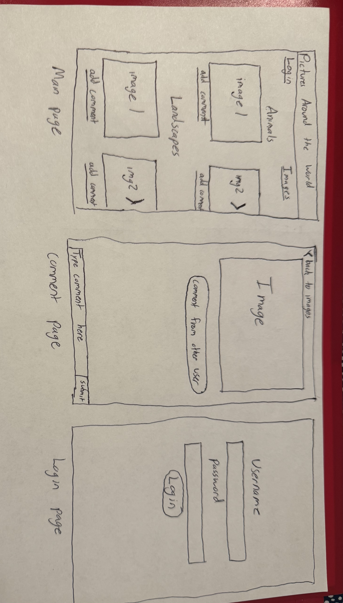
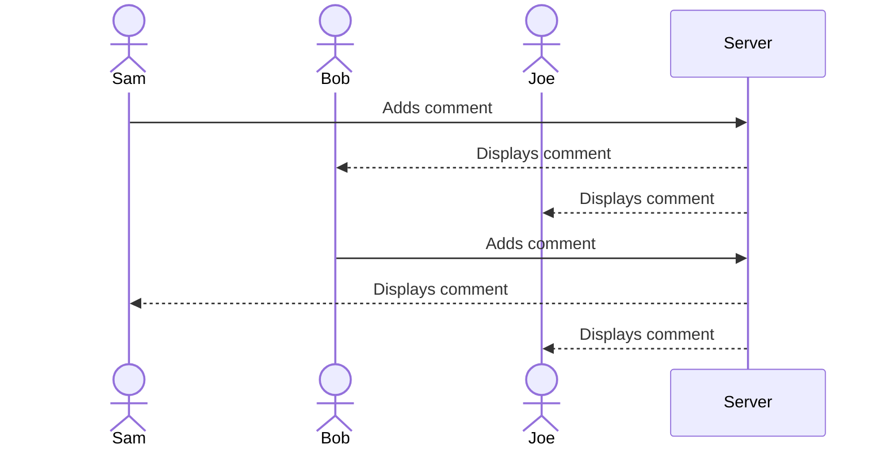

# Pictures Around the World Website

[My Notes](notes.md)

This application will display various photographs that users can view and then leave comments. These comments will then be posted and can be viewed by other users. 

## 🚀 Specification Deliverable

For this deliverable I did the following. I checked the box `[x]` and added a description for things I completed.

- [x] Proper use of Markdown
- [x] A concise and compelling elevator pitch
- [x] Description of key features
- [x] Description of how you will use each technology
- [x] One or more rough sketches of your application. Images must be embedded in this file using Markdown image references.

### Elevator pitch

Pictures Around the World is your go-to destination to view breathtaking photographs. Whether you are a photography enthusiast or a casual admirer, my website will bring stunning visuals right to your fingertips. You will also be able to engage with others by reacting to the photos and leaving thoughtful comments. Pictures Around the World is not just another website; it is a hub where every photo is a shared experience.

### Design

### Key features

- Secure login over HTTPS
- Displays various images
- Ability to leave comments on images
- Comments are posted for others to see in realtime
- Ability for users to edit and delete their own comments
- Ability for admin to delete comments

### Technologies

I am going to use the required technologies in the following ways.

- **HTML** - Use correct HTML structure. 3 HTML pages: one for login, one for displaying images, and one for leaving comments. Hyperlinks between photos and comment page
- **CSS** - Application looks good on different screen sizes. Properly formats images with text and color schemes. 
- **React** - Provides login. Retrieves and displays comments that users submit. 
- **Service** - Backend service with endpoints for login and leaving comments. 3rd party call to get inspirational quotes.
- **DB/Login** - Stores users and comments in database. Login and register users. Credentials will be securely stored in database. Can only leave comments if authenticated. 
- **WebSocket** - When a user leaves a comment, all other users will be able to see it.

## 🚀 AWS deliverable

For this deliverable I did the following. I checked the box `[x]` and added a description for things I completed.

- [x] **Server deployed and accessible with custom domain name** - [My server link](https://startup.picsaw.click).

## 🚀 HTML deliverable

For this deliverable I did the following. I checked the box `[x]` and added a description for things I completed.

- [x] **HTML pages** - Three different pages. One for each view. `index.html` (login), `pictures.html` (view pictures), and `comments.html` (leave comments) 
- [ ] **Proper HTML element usage** - I did not complete this part of the deliverable.
- [x] **Links** - Links between pages.
- [ ] **Text** - I did not complete this part of the deliverable.
- [x] **3rd party API placeholder** - `index.html` has a place to display inspirational quotes.
- [ ] **Images** - I did not complete this part of the deliverable.
- [x] **Login placeholder** - `index.html` has placeholder for login.
- [ ] **DB data placeholder** - I did not complete this part of the deliverable.
- [x] **WebSocket placeholder** - `pictures.html` has an area where notifications will be pushed when a user leaves a comment.

## 🚀 CSS deliverable

For this deliverable I did the following. I checked the box `[x]` and added a description for things I completed.

- [ ] **Header, footer, and main content body** - I did not complete this part of the deliverable.
- [ ] **Navigation elements** - I did not complete this part of the deliverable.
- [ ] **Responsive to window resizing** - I did not complete this part of the deliverable.
- [ ] **Application elements** - I did not complete this part of the deliverable.
- [ ] **Application text content** - I did not complete this part of the deliverable.
- [ ] **Application images** - I did not complete this part of the deliverable.

## 🚀 React part 1: Routing deliverable

For this deliverable I did the following. I checked the box `[x]` and added a description for things I completed.

- [ ] **Bundled using Vite** - I did not complete this part of the deliverable.
- [ ] **Components** - I did not complete this part of the deliverable.
- [ ] **Router** - Routing between login and voting components.

## 🚀 React part 2: Reactivity

For this deliverable I did the following. I checked the box `[x]` and added a description for things I completed.

- [ ] **All functionality implemented or mocked out** - I did not complete this part of the deliverable.
- [ ] **Hooks** - I did not complete this part of the deliverable.

## 🚀 Service deliverable

For this deliverable I did the following. I checked the box `[x]` and added a description for things I completed.

- [ ] **Node.js/Express HTTP service** - I did not complete this part of the deliverable.
- [ ] **Static middleware for frontend** - I did not complete this part of the deliverable.
- [ ] **Calls to third party endpoints** - I did not complete this part of the deliverable.
- [ ] **Backend service endpoints** - I did not complete this part of the deliverable.
- [ ] **Frontend calls service endpoints** - I did not complete this part of the deliverable.

## 🚀 DB/Login deliverable

For this deliverable I did the following. I checked the box `[x]` and added a description for things I completed.

- [ ] **User registration** - I did not complete this part of the deliverable.
- [ ] **User login and logout** - I did not complete this part of the deliverable.
- [ ] **Stores data in MongoDB** - I did not complete this part of the deliverable.
- [ ] **Stores credentials in MongoDB** - I did not complete this part of the deliverable.
- [ ] **Restricts functionality based on authentication** - I did not complete this part of the deliverable.

## 🚀 WebSocket deliverable

For this deliverable I did the following. I checked the box `[x]` and added a description for things I completed.

- [ ] **Backend listens for WebSocket connection** - I did not complete this part of the deliverable.
- [ ] **Frontend makes WebSocket connection** - I did not complete this part of the deliverable.
- [ ] **Data sent over WebSocket connection** - I did not complete this part of the deliverable.
- [ ] **WebSocket data displayed** - I did not complete this part of the deliverable.
- [ ] **Application is fully functional** - I did not complete this part of the deliverable.
